# NAS Monitor · 飞牛 NAS 监控与 Android 显示终端

**在网页管理 NAS，在闲置手机、平板或 ESP8266 小屏幕上随时查看状态。**

NAS Monitor 包含飞牛 FPK 服务端、网页控制台、Android 原生 App 和 ESP8266 固件。服务端统一采集网络、CPU、内存、磁盘、温度、存储空间与可用的 GPU / UPS 数据，各显示端读取同一数据源。只用浏览器也能使用，不必购买小屏幕。

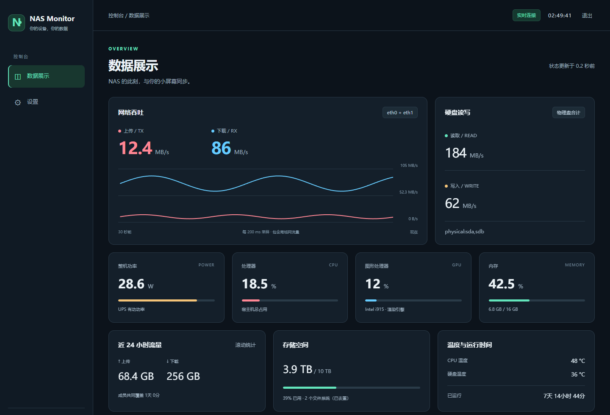

*飞牛 1.3.0-5 真实网页前端，使用示例数据在本地截图；读数不代表实机性能。*

**[下载最新版](https://github.com/xushuojie/routermonitor-fnos/releases/latest)** · [Android 教程](#android-app) · [飞牛安装](#fnos-install) · [网页教程](#web-console) · [常见问题](#faq) · [使用说明书](docs/使用说明书.md)

## 目录

- [下载、版本与适用设备](#downloads)
- [第一次使用：从安装到连接](#quick-start)
- [Android App：功能、安装、设置与升级](#android-app)
- [飞牛 FPK：安装、升级与数据保留](#fnos-install)
- [网页控制台：指标、Token、硬件、网络与备份](#web-console)
- [ESP8266 桌面小屏幕](#esp8266)
- [常见问题与排查](#faq)
- [源码、构建与验证范围](#development)

<a id="downloads"></a>
## 下载、版本与适用设备

新增功能 **1.3.0-7：支持选择 UPS / 平台 / CPU 封装功率并同时展示各项读数**。网页明确标注范围，无传感器时保持不可用；新版 FPK 已在下方 Release 提供。详见[功率来源与升级说明](docs/功率来源与降级.md)。

当前发布：[v1.3.0-7 Release](https://github.com/xushuojie/routermonitor-fnos/releases/tag/v1.3.0-7)。**Release 标签对应飞牛版本，Android APK 自身版本为 1.1.5-adaptive-test。**

| 组件 | 版本 / 要求 | 下载或入口 |
| --- | --- | --- |
| 飞牛 FPK | **1.3.0-7**；x86-64 / amd64；需要 Docker，含离线镜像 | [下载 FPK](https://github.com/xushuojie/routermonitor-fnos/releases/download/v1.3.0-7/routermonitor-fnos-1.3.0-7-amd64.fpk) |
| Android App | **1.1.5-adaptive-test**；最低 Android 4.3 / API 18 | [下载 APK](https://github.com/xushuojie/routermonitor-fnos/releases/download/v1.3.0-7/routermonitor-android-1.1.5-adaptive-test.apk) |
| 网页控制台 | 随 FPK 提供，无需另装网页程序 | 安装后访问 `http://NAS局域网IP:18199` |
| 安装包校验 | SHA-256 | [下载校验文件](https://github.com/xushuojie/routermonitor-fnos/releases/download/v1.3.0-7/SHA256SUMS.txt) |
| ESP8266 固件 | 本次未更新；ST7789 / ILI9341 | [历史发行版](https://github.com/xushuojie/routermonitor-fnos/releases) |
| 完整源码 | Android、飞牛、网页与 ESP8266 | [下载 main 分支 ZIP](https://github.com/xushuojie/routermonitor-fnos/archive/refs/heads/main.zip) |

也可从 [downloads 目录](downloads/) 获取安装包，在文件页面点击 **Download raw file**，不要保存成 GitHub 网页。

**Android 仍是测试版**：包名 `io.github.routermonitor.fnos.layouttest`，使用测试签名。Latest 表示最新下载入口，不表示 APK 已改成正式签名。FPK 尚未完成飞牛实机安装验收，测试范围见文末。

<details>
<summary>如何校验下载文件</summary>

将两个安装包和 `SHA256SUMS.txt` 放在同一目录。

Linux 执行 `sha256sum -c SHA256SUMS.txt`；macOS 执行 `shasum -a 256 -c SHA256SUMS.txt`，应显示 `OK`。

Windows PowerShell：

```powershell
Get-FileHash .\routermonitor-fnos-1.3.0-7-amd64.fpk -Algorithm SHA256
Get-FileHash .\routermonitor-android-1.1.5-adaptive-test.apk -Algorithm SHA256
```

将输出与校验文件逐项对照。

</details>

<a id="quick-start"></a>
## 第一次使用：从安装到连接

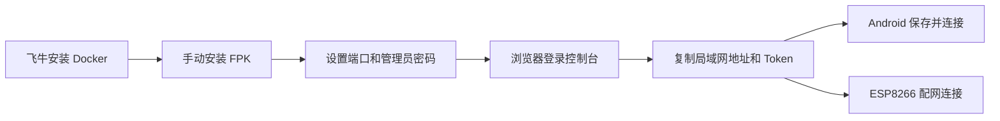

1. **先装服务端**：在飞牛应用中心手动安装 FPK，填写端口和管理员密码。
2. **确认网页能打开**：访问 `http://NAS局域网IP:18199`；修改过端口则使用实际端口。
3. **获取连接信息**：登录后进入 **设置 → 设备与管理 → 安卓 / ESP8266 显示端**，复制局域网地址、查看只读 Token。
4. **连接 Android App**：填入上述地址和 Token，点击 **保存并连接**。
5. **按需选择统计范围**：网页设置中选择存储卷和网卡；也可先保持自动发现，观察基础数据。

| 信息 | 用途 | 获取方式 |
| --- | --- | --- |
| 服务地址 | 浏览器与显示端连接 NAS | 如 `http://192.168.1.10:18199`，示例 IP 需替换 |
| 管理员密码 | 网页登录和管理 | 飞牛安装向导中自行设置 |
| 只读 Token | Android / ESP8266 读取指标 | 网页“设备与管理”查看或自定义 |

**管理员密码与只读 Token 不可互换。** App 不需要管理员密码，网页登录也不能用 Token 代替密码。

<a id="android-app"></a>
## Android App：把手机和平板变成 NAS 监控屏

原生 Java + Canvas 显示，无 WebView、Google Play 服务或原生 `.so` 依赖。横屏、竖屏、平板和分屏会按实际窗口重新排版；字号跟随系统字体比例，窗口过小时可上下滚动。

### 界面预览

<p align="center"></p>

*手机竖屏：大字时间、网速曲线、磁盘读写、轮播信息和底部指标纵向排列。*


*平板横屏：空间足够时展开辅助信息卡片。以上两图是已有 Android 1.1.0 / API 37 模拟器截图，使用极限示例数据检查布局，不是 1.1.5 实机截图。1.1.5 另增加全屏、OLED 保护及分系统设置风格。*

### App 能显示什么

| 区域 | 显示内容 | 使用提示 |
| --- | --- | --- |
| 时间 | 大字时钟、星期和日期 | 使用上海时区，支持服务端时间校准 |
| 网络 | 上传、下载与近 60 秒曲线 | 上传红色、下载蓝色；纵轴按窗口峰值调整 |
| 磁盘 | 实时读写速率 | 来自 NAS，不是手机自身读写 |
| 轮播 / 展开卡片 | 24 小时流量、运行时间、温度、存储空间 | 默认轮播；大平板可常驻展开 |
| 指标卡片 | 功率、CPU、GPU、内存 | 不支持或过期的读数显示 `—`，不当作 0 |

### 安装与第一次连接

1. 在 Android 下载 APK，按系统提示允许当前下载来源安装应用。
2. 打开 **NAS Monitor 布局测试**。
3. 点击右上角设置入口，或长按画面，打开 **NAS 显示终端设置**。
4. 输入服务**根地址**，例如 `http://192.168.1.10:18199`，不要附加 `/status`、`/net` 或网页登录路径。
5. 输入网页提供的**只读 Token**，确认没有多余空格或换行。
6. 点击 **保存并连接**，检查在线状态及指标是否持续刷新。
7. Android 17 如提示局域网访问权限，请授权；之前拒绝过可从 App 设置的局域网权限入口恢复。

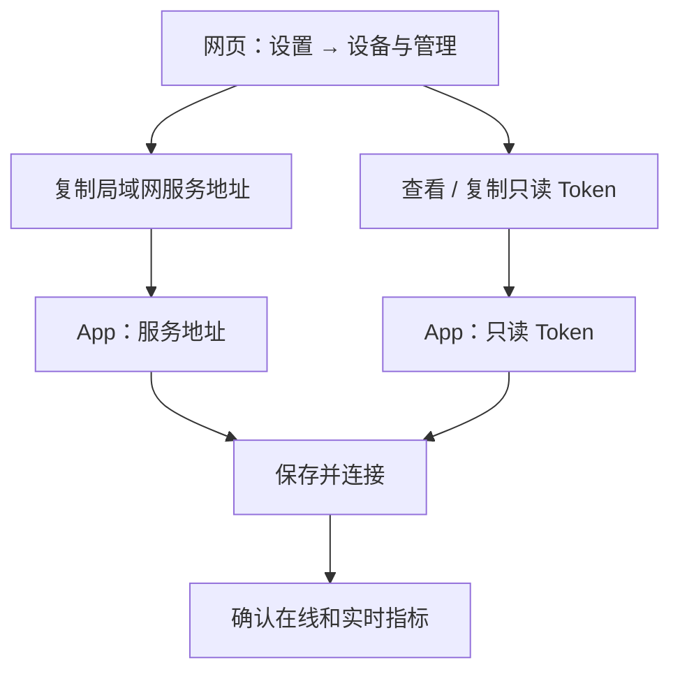

连接信息在这里获取。图中 IP 为示例，以自己的 NAS 页面为准：

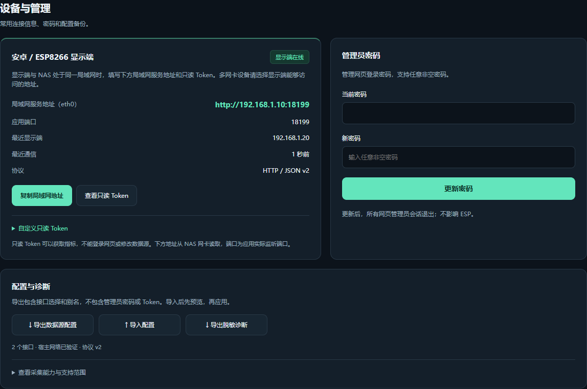

### 亮度、夜间模式与 OLED 设置

| 设置 | 默认 / 范围 | 作用 |
| --- | --- | --- |
| 日间亮度 | 默认 30%；10–100% | 只调整 App 窗口亮度，不改系统全局设置 |
| 定时夜间模式 | 默认开启 | 可关闭自动夜间切换 |
| 夜间起止时间 | 默认 23:00–07:00 | 点击时间选择器修改，精确到分钟，支持跨午夜 |
| 夜间亮度 | 默认 10%；1–100% | 与日间亮度独立，保存后立即生效 |
| OLED 保护 | 默认开启 | 纯黑背景、柔和白字和定时微移 |
| 闲置降亮度 | 默认开启 | 5 分钟无操作后，约 1 分钟逐步降至当前亮度的 60%，最低 1% |
| 网络曲线刷新 | 均衡 500ms；可选 200ms | 控制 App 请求节奏，不保证高于服务端采样速度 |
| 平板展开 | 可在设置中切换 | 大窗口常驻辅助卡片，关闭后恢复轮播 |

夜间按上海时区计算，开启时刻计入夜间，关闭时刻恢复日间亮度；起止时间相同时表示全天夜间。触摸、键盘操作、进入设置或返回 App 会恢复当前时段亮度。

OLED 微移每分钟进行一次，范围为水平 / 垂直 ±4 个物理像素。这些措施只能降低长期显示风险，不能保证避免烧屏。前台保持亮屏，后台停止轮询并允许系统休眠；当前没有后台常驻和开机自启。

### 分系统设置风格

| 系统 | 1.1.5 设置界面 |
| --- | --- |
| Android 4.3–4.4 / API 18–20 | 系统 Holo |
| Android 5–11 / API 21–30 | 系统 Material |
| Android 12+ / API 31+ | 随应用打包的 Material 3 |

设置打开时跟随系统深浅色。Material 3 来自应用组件库，不依赖厂商提供同款界面。布局、协议和构建细节见 [Android 模块说明](android/README.md)。

### 升级与设置保留

- **同签名 1.1.1–1.1.4 测试版**：可覆盖安装，保留地址、Token 和偏好设置。
- **旧正式版**：与本测试版包名不同，可并存；首次使用测试版需重新配置。
- **自行编译版本**：默认 debug 签名可能不同，不能保证覆盖已安装测试版。源码不含签名私钥。
- 覆盖安装失败先核对包名和签名，不要急于卸载；卸载会清除该 App 自身设置。

<a id="fnos-install"></a>
## 飞牛 FPK：安装、升级与数据保留

FPK 将服务端、网页资源、安装向导和离线 Docker 镜像打包在一起。装好后从浏览器即可管理，不必再安装网页程序。

### 安装前准备

- NAS 为 **x86-64 / amd64** 架构；当前 FPK 不是 ARM 安装包。
- Docker 已安装且可以正常启动容器。
- 准备未占用的端口，默认 `18199`。
- 准备非空管理员密码，两次输入必须一致。
- 手机或电脑能访问 NAS 所在网络。

### 图解安装流程

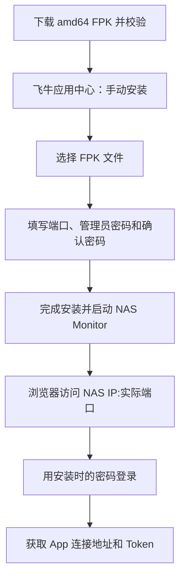

*流程图为操作示意，不是飞牛应用中心实机截图。不同飞牛版本的手动安装入口位置可能不同，以系统界面为准。*

1. 在飞牛应用中心找到**手动安装 / 本地安装**入口，选择 `routermonitor-fnos-1.3.0-7-amd64.fpk`。
2. 在 **NAS Monitor 初始设置**向导填写下表内容。
3. 完成安装并启动应用。首次启动需加载包内镜像，等待应用进入运行状态。
4. 浏览器访问 `http://NAS的IP:实际端口`，例如 `http://192.168.1.10:18199`。
5. 输入安装时的管理员密码。先检查 CPU、内存和网络，再按需选择其他硬件来源。

| 向导字段 | 应填内容 | 常见错误 |
| --- | --- | --- |
| 网页 / 设备接口端口 | 默认 `18199`，允许 `1024–65535` | 填入完整 URL 或使用被占用端口 |
| 设置管理员密码（非空即可） | 自己设置的网页密码 | 误认为 Android 的只读 Token |
| 再次输入管理员密码（非空即可） | 与上一次一致 | 两次输入不一致 |

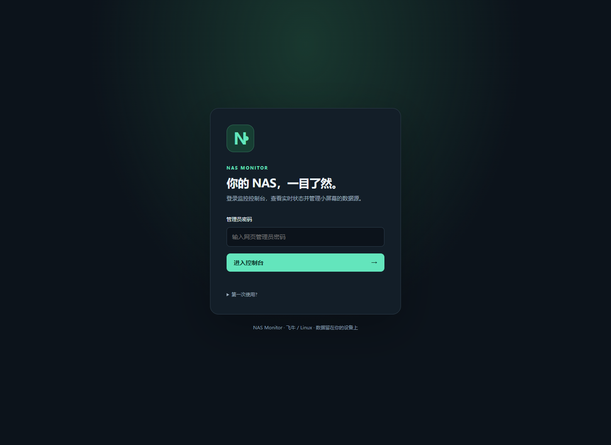

*FPK 用户使用安装向导中设置的密码。登录页“第一次使用”提到的初始密码文件主要用于自动生成密码的部署场景。*

### 升级、端口与密码

| 操作 | 当前行为 | 操作后检查 |
| --- | --- | --- |
| 安装新版 FPK | 应用中心升级，沿用持久化数据卷 | 应用状态、登录和历史数据 |
| 升级时端口留空 | 沿用当前端口 | 使用原地址访问 |
| 升级时密码留空 | 沿用当前密码 | 使用原密码登录 |
| 升级时填写两次新密码 | 重设管理员密码 | 用新密码登录 |
| 修改端口 | 网页与显示端地址一起变化 | 同步更新 Android / ESP8266 地址 |
| 网页修改 Token | 新 Token 立即生效，旧值失效 | 所有显示端同步更新 |

数据卷 `routermonitor-fnos-data` 保存设置、凭据及流量历史，升级和卸载保留该卷。重新安装时，安装向导填写的密码会重设管理员密码，Token 和历史仍从保留的数据卷读取。手动删除数据卷会丢失持久化数据；升级前可按自己的备份方案备份该卷。

网页“导出数据源配置”只包含网卡选择与别名，不是整个数据卷备份，也不包含全部硬件设置、管理员密码或 Token。

### FPK 与独立 Docker 部署

| 方式 | 目录 | 说明 |
| --- | --- | --- |
| 最新飞牛 FPK | `fnos/` | 飞牛应用中心安装、升级；本页新版网页与硬件功能对应此目录 |
| 独立 Docker | `nas-docker/` | 此前的独立部署版本，自行管理 Compose；功能与最新 FPK 有差异 |

不要把旧 Compose 模板与 FPK 生命周期文件混用。同一 NAS 再启动独立部署需避开端口和数据配置冲突。独立部署步骤见 [nas-docker/README.md](nas-docker/README.md)。

<a id="web-console"></a>
## 网页控制台：详细使用教程

左侧有 **数据展示**和**设置**两个页面；设置页可快速定位到 **设备与管理、硬件与采集、网络数据源**。

以下图片由 1.3.0-5 实际网页前端配合固定示例 API 数据生成，不包含真实密码、Token 或实机性能数据。来源和复现方式见 [截图说明](docs/screenshots/README.md)。

### 1. 数据展示：读懂指标


| 数据块 | 含义 | 注意事项 |
| --- | --- | --- |
| 网络吞吐 | 所选接口上传 / 下载，近 30 秒曲线 | 包含局域网传输，不是单纯互联网流量 |
| 硬盘读写 | 物理块设备合计 I/O | RAID 体现底层设备实际读写，不等于共享文件夹速度 |
| 功率 | UPS、平台、CPU 封装独立读数，可选择主卡片来源 | 不是根据 CPU 占用率估算；缺少数据时显示不可用 |
| CPU / GPU / 内存 | 宿主机占用与来源 | GPU 依赖驱动与数据源；一项不可用不影响其他项 |
| 24 小时流量 | 已观测历史滚动统计 | 初装不补造安装前数据，留意覆盖时长 |
| 存储空间 | 所选文件系统去重后的容量 | 配合逐卷卡片核对计入范围 |
| 温度与运行时间 | CPU、硬盘温度及 NAS 运行时长 | 来源可在硬件设置中选择 |

网页曲线显示近 **30 秒**，Android 显示近 **60 秒**，窗口长度不同。服务断开或数据过期时隐藏旧读数，恢复后自动更新。

### 2. 逐卷空间：确认容量范围

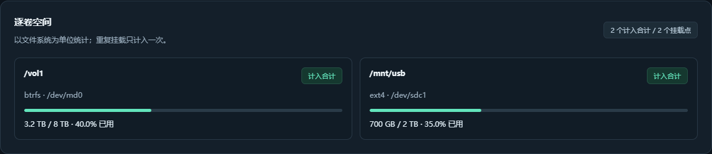

每卷显示挂载路径、文件系统、底层来源、已用 / 总容量和计入状态。先看合计，再核对每卷。

- 重复挂载和 Btrfs 子卷去重，避免重复计算。
- 手选卷掉线时合计可能不可用，避免给出偏小总量。
- 同路径换盘后，先移除该路径并保存，再重新选择以更新卷身份。
- ZFS 同池数据集可能共享空间，无法可靠相加时保留逐卷信息、合计标记不可用。
- 网络共享、伪文件系统和容器挂载不作为本地存储自动计入；未挂载的裸硬盘没有文件系统空间可统计。

### 3. 设备与管理：复制连接信息


1. 打开 **设置 → 设备与管理**。
2. 找到 **安卓 / ESP8266 显示端**卡片。
3. 点击 **复制局域网地址**；多网卡时选择手机能访问的地址。
4. 点击 **查看只读 Token**，复制到 App 或 ESP8266。
5. 连接成功后，检查“显示端在线”“最近显示端”“最近通信”。

“最近显示端”是最近通信的设备，不是全部设备列表。通过飞牛远程入口打开网页时，这里仍提供 NAS 局域网地址；不要把远程门户页面 URL 直接粘贴到 App。

### 4. 自定义只读 Token

<p align="center">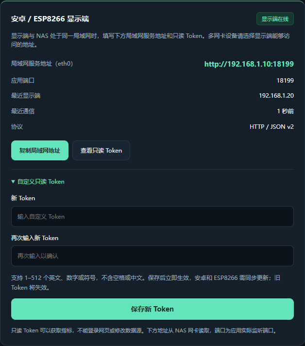</p>

1. 展开 **自定义只读 Token**。
2. 输入新 Token，并再次输入确认。
3. 点击 **保存新 Token**，等待成功提示。
4. 同步修改所有显示端的 Token。

允许 1–512 个 ASCII 可见字符，可含英文、数字和符号，不含空格、中文或换行。保存立即生效，不需重启；旧 Token 随即失效。只读 Token 只能获取指标，不能登录网页或修改数据源。

### 5. 硬件与采集

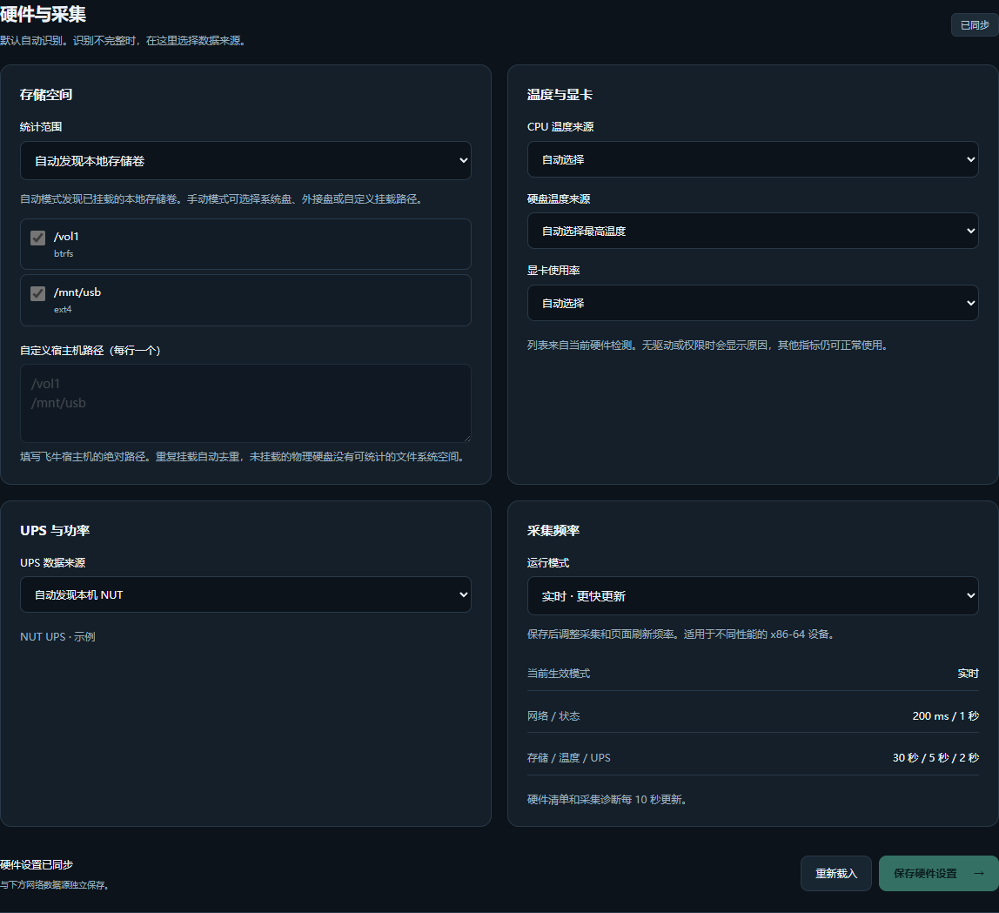

#### 选择存储卷

1. 打开 **硬件与采集 → 存储空间**。
2. 默认 **自动发现本地存储卷**，可先保持默认检查发现结果。
3. 只想统计部分卷时切换为 **手动选择存储卷**。
4. 勾选所需卷；也可填写宿主机绝对路径，每行一个，如 `/vol1`、`/mnt/usb`。
5. 点击 **保存硬件设置**，回到数据展示检查逐卷信息和合计。

路径是飞牛宿主机路径，不是电脑盘符或容器内部 `/data`。手动模式至少选择一个范围；不要填写不存在的目录或含 `..` 的路径。

#### 温度与显卡

- CPU 温度可自动选择、指定传感器或关闭。
- 硬盘温度默认自动取最高值，也可指定或关闭。
- GPU 可自动、手选或关闭。AMD 使用系统利用率；Intel 使用可用引擎计数或宿主机 `intel_gpu_top`；NVIDIA 使用宿主机已有 `nvidia-smi`。
- 列表来自实际检测。没有驱动、工具或可读来源时显示原因；应用不会安装驱动或工具。Intel 取可用引擎中的最高利用率，不是简单相加。

#### UPS 设置

| 方式 | 需要填写 | 使用场景 |
| --- | --- | --- |
| 自动 | 通常无需填写 | 自动发现本机 NUT |
| 本机 NUT | 已发现 socket 或绝对路径 | NAS 本机 NUT 服务 |
| 远程 NUT | 主机、端口、设备名 | 默认端口 `3493`；设备名与 NUT 配置一致 |
| 关闭 | 无 | 不采集 UPS |

保存后回到数据展示确认功率与诊断。没有有功功率时不会将 VA 当成 W；UPS 如果给多个设备供电，其输出功率不能等同于 NAS 单机功耗。

#### 采集档位

| 档位 | 网络 | 状态 | 存储 | 温度 | UPS |
| --- | --- | --- | --- | --- | --- |
| 实时 | 0.2 秒 | 1 秒 | 30 秒 | 5 秒 | 2 秒 |
| 标准 | 0.5 秒 | 1 秒 | 45 秒 | 10 秒 | 5 秒 |
| 低占用 | 1 秒 | 2 秒 | 60 秒 | 15 秒 | 10 秒 |

选择“运行模式”后点 **保存硬件设置**。流量历史持久化仍为每 5 秒；网页硬件清单与诊断约每 10 秒刷新。服务端采集档位与 Android 的 200ms / 500ms 请求频率是独立设置。

### 6. 网络数据源：网卡、别名与合计

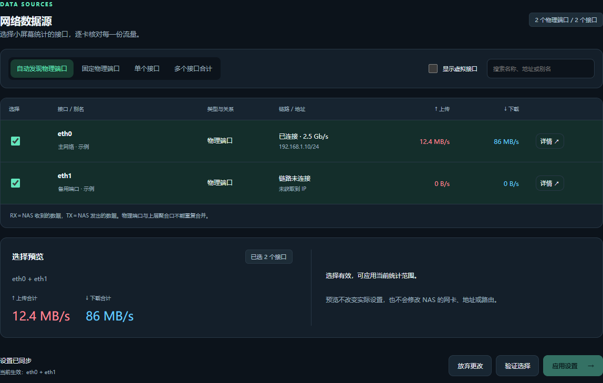

1. 打开 **设置 → 网络数据源**。
2. 查看接口名称、类型、链路速率和 IP。默认显示物理端口，可展开虚拟接口、搜索和设置别名。
3. 选择自动发现、单卡或多卡统计，核对勾选接口。
4. 点击 **验证选择**，检查合计预览与拓扑警告。
5. 确认后点击 **应用设置**；只做预览不会改变正式统计。
6. 回到数据展示核对来源标识。Android 和 ESP8266 自动跟随新统计范围。

避免同时合计同一流量经过的上下层接口，例如物理网卡与网桥、聚合接口。系统检查已知重复关系，仍需结合实际拓扑。此操作只改变监控统计范围，不修改 NAS 的 IP、网卡或路由。

**三个保存按钮相互独立**：硬件点“保存硬件设置”，网卡点“应用设置”，Token 点“保存新 Token”。

### 7. 密码、配置与诊断

- **管理员密码**：输入当前密码、新密码，点击“更新密码”。所有网页会话退出，重新登录即可；Token 不变。
- **导出数据源配置**：导出网卡选择和别名 JSON，不包含密码或 Token。
- **导入配置**：选择 JSON，检查预览，再点“应用设置”，不是导入后立即生效。
- **脱敏诊断**：用于定位硬件来源和不可用原因，不是完整备份。
- **重新载入硬件设置**：恢复服务端已保存值，可放弃当前未保存更改。

### 8. 手机浏览器

<details>
<summary>展开手机网页长截图（真实前端，示例数据）</summary>

<p align="center">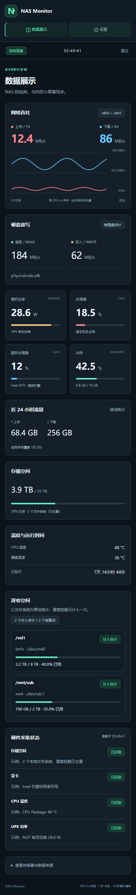</p>

</details>

手机浏览器也能查看和管理，不必安装 App。App 更适合常亮大字显示，网页提供完整管理；两者都需要能访问 NAS。

<a id="esp8266"></a>
## ESP8266 桌面小屏幕

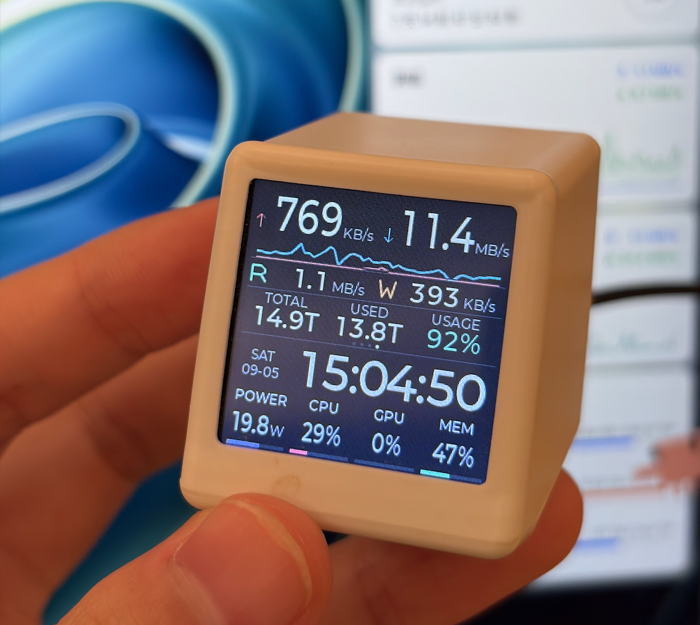

支持 ESP8266 / NodeMCU v2 + ST7789 240×240，或 ILI9341 的 240×240 显示区域。与 Android 共用指标接口，本次 Release 未更新固件。

| 流量 | 运行时间 | 温度 | 存储 |
| --- | --- | --- | --- |
|  |  |  |  |

*以上小屏图由实际 LVGL 界面使用示例数据渲染，不是实机照片。*

首次无法连接 Wi-Fi 时会建立 `RouterMonitor-XXXXXX` 热点，屏幕显示本次随机密码。连接后访问 `http://192.168.4.1/`，填写 Wi-Fi、NAS 地址、端口和 Token。接线、PlatformIO 编译、烧录、配网与历史验证见 [ESP8266 参考](docs/ESP8266-guide.md)。

<a id="faq"></a>
## 常见问题与排查

| 问题 | 处理顺序 |
| --- | --- |
| FPK 安装或启动失败 | 核对 amd64、Docker 状态、文件校验和端口占用，查看应用及容器日志 |
| 网页打不开 | 确认应用启动、NAS IP 和端口正确，再查防火墙与网络 |
| 网页密码错误 | 用安装时的管理员密码，不是 Token；可通过升级向导填写两次新密码重设 |
| 电脑能打开，手机打不开 | 检查访客 Wi-Fi、客户端隔离及手机到 NAS 的网络可达性 |
| App 连接失败 | 先在同一手机浏览器访问 NAS，再查根地址、端口、Token 与局域网权限 |
| 改 Token 后掉线 | 旧值已失效，给所有显示端更新新值 |
| 横屏显示不全 | 使用新版测试 APK；短窗口或大字体时可滚动；设置入口在顶部 |
| 夜间亮度不对 | 核对上海时区起止时间、日夜亮度与闲置降亮度；起止相同为全天夜间 |
| GPU / 温度 / UPS 不可用 | 检查采集状态、来源选择、驱动、工具和 NUT；未知值不会伪装成 0 |
| 容量不符 | 核对逐卷范围、卷掉线、同路径换盘和 ZFS 共享空间 |
| 24h 流量没有一天 | 初装从实际观测开始，切换接口后还要看共同覆盖时长 |
| 设置没有生效 | 使用对应区域保存按钮；网络预览后需“应用设置” |
| APK 签名冲突 | 核对包名、测试签名；自行构建包可能不能覆盖当前包 |
| 卸载重装历史还在 | FPK 默认保留数据卷，卸载不等于清空数据 |

建议按 **应用状态 → 地址与端口 → 手机网络 → 密码 / Token → 硬件来源** 排查，先解决连接，再判断单项硬件。

### 访问与凭据

默认 HTTP 不加密，优先使用可信局域网或 VPN。不要在问题报告中公开 Token，泄露后在网页轮换。不同部署方式的反向代理与远程入口配置存在差异，旧 `nas-docker/` 的安全配置选项不等于当前 FPK 已实现同样选项。

<a id="development"></a>
## 源码、构建与验证范围

```text
.
├─ android/             Android 原生 App、Gradle 与测试
├─ fnos/                最新飞牛服务端、生命周期和打包源码
│  ├─ app/web/          本页新版 HTML / CSS / JavaScript
│  ├─ package/          已发布 FPK 的可读安装资源快照
│  └─ tests/            后端、硬件、Token、存储与接口测试
├─ nas-docker/          此前的独立 Docker 部署版本
├─ src/                 ESP8266 固件
├─ include/             屏幕驱动与引脚
├─ downloads/           FPK、APK 与校验文件
├─ docs/                说明书、ESP8266 参考与截图脚本
└─ images/              照片、模拟器截图和网页教程图
```

| 任务 | 入口 |
| --- | --- |
| Android 构建 | [构建说明](android/README.md#构建与验证)，需要 JDK、SDK、Gradle 依赖及合适的签名密钥 |
| 飞牛重打包 | [构建说明](fnos/README.md)，`python3 fnos/build_fpk.py`，复用发布包离线镜像基底 |
| FPK 校验 | `python3 fnos/verify_fpk.py` |
| 后端测试 | Linux / WSL：`python3 fnos/tests/run_all.py` |
| 局域网前端测试 | `node fnos/tests/test_lan_ui.cjs` |
| 网页截图复现 | [截图来源和步骤](docs/screenshots/README.md) |
| ESP8266 编译烧录 | [详细参考](docs/ESP8266-guide.md#2-编译和烧录固件) |

已完成发布验证：50 项 Linux 后端测试、局域网地址前端测试、FPK / OCI 摘要和源码一致性校验、重新打包校验、APK v1/v2/v3 签名校验。Android 1.1.5 有 13 项 Robolectric 控件测试通过报告。已有 Android 4.3 手机及 API 37 模拟器记录主要来自旧正式版，不能视为新版所有机型验收。

尚未完成飞牛 FPK 实机安装验收、Android 测试版全部目标机型验收及长期压力测试。ST7789 有历史实机验证，ILI9341 仅编译验证。示例图片不能用来判断某台 NAS 一定支持全部指标。

## 许可证与致谢

基于 [404SynapseNotFound/routermonitor](https://github.com/404SynapseNotFound/routermonitor) 修改，继续使用 [GNU GPL v3](LICENSE)。感谢原作者及 LVGL、TFT_eSPI、ArduinoJson、PlatformIO、AndroidX、Material Components 等开源项目。ESP8266 字体子集派生自 LVGL 的 Montserrat 位图。
