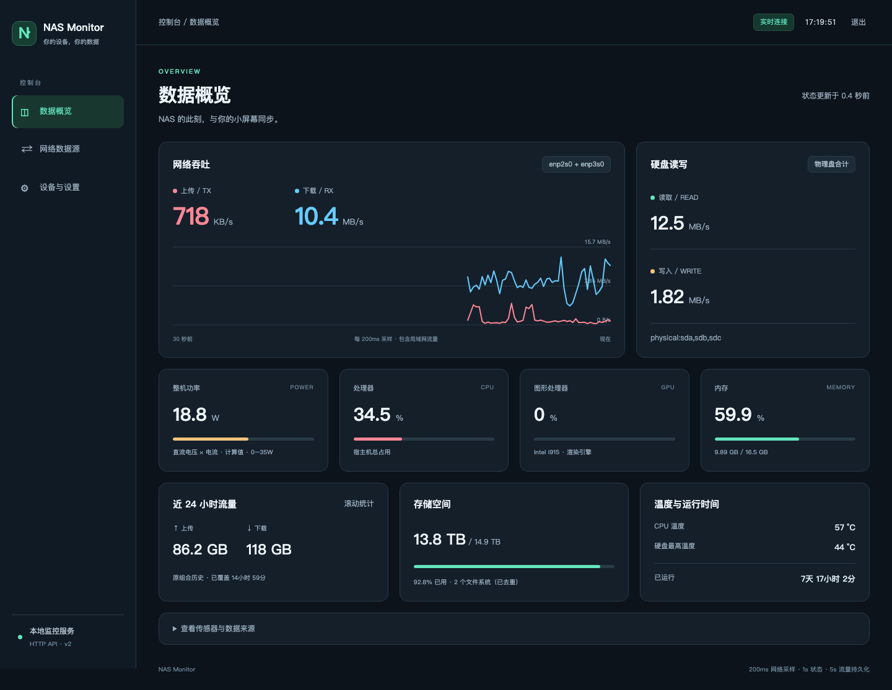
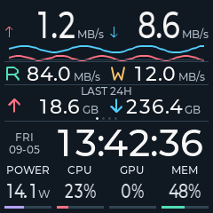
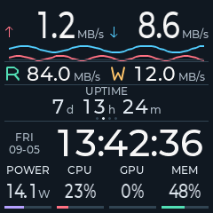
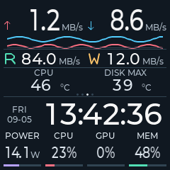
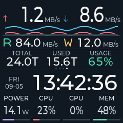
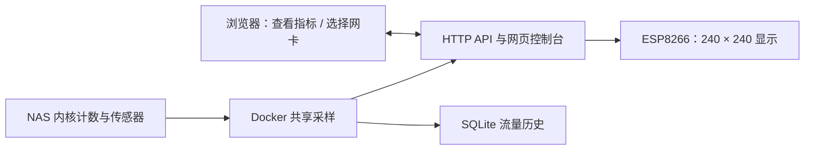

# Router Monitor for FNOS NAS

**飞牛 / Linux NAS 网页控制台 + ESP8266 桌面监控屏**

[快速部署](#1-部署-nas-服务) · [网页控制台](#打开-nas-网页控制台) · [屏幕与烧录](#2-编译和烧录固件) · [服务端完整说明](nas-docker/README.md)



一台基于 ESP8266 和 240 × 240 彩屏的 NAS 桌面监控小电视。设备通过 HTTP 长连接每秒获取 NAS 展示状态，同时每 200 毫秒获取共享网络采样，显示网络与硬盘读写速率、CPU/GPU/内存占用、时间及四页轮播信息。

本项目基于 [404SynapseNotFound/routermonitor](https://github.com/404SynapseNotFound/routermonitor) 修改，数据源由 Netdata 改为随仓库提供的 NAS 状态服务，并增加了 NAS 网页控制台、设备网页配网、Token 鉴权、夜间亮度和故障自动恢复。

### 屏幕预览

以下由当前固件的实际 LVGL 界面渲染，使用示例数据；图片原始尺寸均为 240 × 240，不是实机照片。

| 24 小时流量 | 开机时间 |
| --- | --- |
|  |  |
| CPU / 硬盘温度 | 存储空间 |
|  |  |

## 功能

- NAS 网页：实时概览、全量网卡发现、单卡/多卡统计、别名、拓扑校验、配置导入导出与管理员登录
- `/status?display=1&v=2` 每 1 秒刷新 CPU、GPU、内存、硬盘读写和运行时间；温度每 5 秒、容量每 30 秒、滚动流量每 5 秒采样
- `/net?v=2` 每 200 毫秒更新红色上传、蓝色下载折线，实时网速数字约每 1 秒更新；请求失败后退避重试，恢复后回到目标周期
- 实时网速使用固定 42px 窄体数字，`HH:MM:SS` 使用固定 42px 原比例数字；等宽数字减少跳动，保留 5px 内容留白，四周与界面背景同色
- 硬盘读写速率每 1 秒刷新
- 近 24 小时流量、开机时间、CPU/最高硬盘温度、总容量/已用容量/占用率每 5 秒横向滑动轮播
- NAS 每 5 秒独立采样并持久保存流量，屏幕断电不影响采集
- 时间按 UTC+8 显示，附星期和日期，屏幕不显示时区字样
- 配网 AP 使用随机 WPA2 密码；设备配置页面无需账号密码，保存仍使用 CSRF 校验
- Wi-Fi、NAS 地址和 Token 只保存在设备 LittleFS，不写入固件源码
- 夜间自动降低亮度
- Wi-Fi 恢复后自动显示主页、校时并关闭临时 AP；NAS 故障退避重试，过期指标显示 `--`
- 进入主界面后释放开机动画对象，降低运行时内存占用

## 仓库结构

```text
.
├─ include/TFT_eSPI_Setup.h  # 屏幕驱动与引脚
├─ src/                      # ESP8266 固件和字体资源
├─ nas-docker/               # NAS API、网页控制台、Dockerfile、Compose
├─ platformio.ini            # PlatformIO 构建配置
└─ images/                   # 项目图片
```

## 硬件

两种配置都使用 ESP8266 / NodeMCU v2 和 4 MB Flash，界面为 240 × 240：

| PlatformIO 环境 | 屏幕控制器 | CS | SPI 时钟 | 验证状态 |
| --- | --- | --- | --- | --- |
| `nodemcuv2`（默认） | ST7789，240 × 240 | 无，`-1` | 40 MHz | 已实机烧录；240 秒、47 次滑动、延迟联网及 NAS 故障恢复通过 |
| `nodemcuv2_ili9341` | ILI9341，240 × 240 界面区域 | D8 | 27 MHz | 保留原仓库配置，编译验证，未实机验收 |

公共接线：DC=D3、RST=D4、背光=D1、MOSI=D7、SCLK=D5。ST7789 配置与旧 `sd2` 项目实际选中的 `Setup24_ST7789.h` 一致。ILI9341 的原生面板通常为 240 × 320，本项目保持原有 240 × 240 界面，不会自动拉伸。

固件不自动识别屏幕，烧录时必须选择对应环境。不同批次可能使用其他接线，按需修改 `include/TFT_eSPI_Setup.h` 后先运行 `pio run -e nodemcuv2 -e nodemcuv2_ili9341 --target clean` 再编译，避免复用旧驱动缓存。两套默认背光均按 D1 低电平有效处理；其他背光电路需相应调整。

## 架构与部署



网页和屏幕读取同一份采样快照。更改统计来源后，屏幕自动跟随，无需重新烧录。

## 1. 部署 NAS 服务

NAS 需安装 Docker Compose。获取仓库后执行：

```bash
git clone https://github.com/xushuojie/routermonitor-fnos.git
cd routermonitor-fnos/nas-docker
cp .env.example .env
```

编辑 `.env`：

- `NAS_STATUS_IFACE`：首次启动默认 `physical`，固定选择当时发现的物理网卡；以后通过网页选择单卡或多卡，新网卡不会自动加入
- `NAS_STATUS_PORT`：对局域网开放的端口，默认 `18199`
- `NAS_STATUS_TOKEN`：长随机 Token，可用 `openssl rand -hex 32` 生成

按 NAS 的实际存储卷调整 `compose.yml` 中 `/vol1`、`/vol2` 的只读挂载，并同步修改 `NAS_STATUS_STORAGE_PATHS`。模板使用 host 网络，确认所选端口未被占用。

启动并测试：

```bash
docker compose up -d --build
docker compose logs -f nas-status
curl http://NAS局域网IP:18199/health
curl -H "Authorization: Bearer 你的Token" http://NAS局域网IP:18199/status
```

详细说明见 [nas-docker/README.md](nas-docker/README.md)。不建议把该端口直接暴露到公网；优先在可信局域网、VPN 或防火墙白名单内使用。

### 打开 NAS 网页控制台

访问 `http://NAS局域网IP:18199/`。这是 NAS 服务的管理网页，与 ESP8266 的配网页面不同。

首次启动会生成独立管理员密码；按仓库 Compose 模板部署时可读取：

```bash
docker compose exec nas-status cat /data/initial-admin-password.txt
```

也可在首次启动前设置 `NAS_STATUS_ADMIN_PASSWORD`（至少 12 个字符）。登录后在“设备与设置”中更改密码，原有 ESP Token 不受影响。

- **数据概览**：网络曲线、上下行和磁盘速率、功率、CPU/GPU/内存、24h 流量、容量、温度、运行时间及实际来源。
- **网络数据源**：默认显示物理端口，可展开虚拟接口、搜索、设置别名和查看原始计数/丢包/历史。选择后先预览，点击“应用设置”才会生效；不会修改 NAS 的 IP、网卡或路由。
- **设备与设置**：显示端连接状态、只读 Token、配置导入导出、脱敏诊断和管理员密码。

模板使用 host 网络获取宿主接口，端口由 `NAS_STATUS_PORT` 指定。设置、管理员密码哈希与逐接口历史持久化在原数据卷；升级保留旧组合历史。当前只有网络来源可在网页中选择，其他指标沿用自动检测和部署时的挂载配置，来源与不可用状态可在概览核对。

## 2. 编译和烧录固件

安装 [Visual Studio Code](https://code.visualstudio.com/) 和 PlatformIO 扩展，打开仓库根目录。连接 ESP8266 后运行 PlatformIO 的 Upload；或使用命令行：

默认 ST7789：

```bash
pio run -e nodemcuv2
pio run -e nodemcuv2 --target upload
pio device monitor -e nodemcuv2
```

ILI9341：

```bash
pio run -e nodemcuv2_ili9341
pio run -e nodemcuv2_ili9341 --target upload
pio device monitor -e nodemcuv2_ili9341
```

仅验证两种配置能否编译（不烧录）：

```bash
pio run -e nodemcuv2 -e nodemcuv2_ili9341
```

不指定 `-e` 时默认使用 ST7789。两种环境分别输出到 `.pio/build/nodemcuv2/` 和 `.pio/build/nodemcuv2_ili9341/`，共用相同的 LittleFS 配置布局；切换程序固件不需要重新填写 Wi-Fi 和 NAS 参数。

默认调试串口和烧录速率为 115200（当前 CH340 设备已验证稳定）。界面保留内置 Montserrat 12px 文本字体，数字使用 `src/DisplayFonts.c` 中的 22/42px 字体子集；可运行 `python3 scripts/generate_fonts.py` 从已安装的 LVGL 原始位图重新生成。网速数字在生成时固定为原宽度的 75%，时间保持原比例，所有数字采用固定步进，不在运行中缩放。R/W 和上下行箭头使用固定线条。显示缓冲为 5 行。启用 ESP8266 Core 的 `NON32XFER_HANDLER`，支持 LVGL 对 Flash 字形的字节读取，避免 Exception (3)。

### 240 × 240 主屏布局

| 区域 | 像素范围 | 排版 |
| --- | --- | --- |
| 背景色留白 | x/y=0–4、235–239 | 与界面背景同色，内容仍限制在 x/y=5–234 |
| 实时上传/下载 | x=5–116、123–234，y=5–50 | 数字固定 42px 窄体、70px 槽；箭头 10×14、单位 12px，基线固定 |
| 网络趋势 | x=10，y=51，220 × 18 | 红色上传、蓝色下载，每 200ms 更新，显示近 10 秒 |
| 硬盘读/写 | x=5–116、123–234，y=69–93 | 数字固定 22px、53px 槽；R/W 固定 16 × 16、单位 12px |
| 四页轮播 | x=5–234，y=95–136 | 内容 y=96–130、标题 12px、数值 22px；页点 y=132–134 |
| 日期与时间 | x=5–234，y=138–184 | 左侧星期/日期 12px；`HH:MM:SS` 固定 42px、字间距 -2px |
| POWER / CPU / GPU / MEM | 列起点 x=5、64、123、182，y=184–234 | 四列各 53px、间距 6px；数字为固定 22px 窄体，标题和 W 单位 12px，底部 53×3px 进度条 |

网速与硬盘速率只在文本变化时更新，字号、图标和单位位置固定。实时速率保留最多三位有效数字，例如 `99.4 MB/s`、`100 MB/s`、`140 MB/s`、`999 MB/s`、`1.0 GB/s`；采用十进制单位。累计量保留一位小数，容量页使用三位有效数字与短单位。全部 86400 个时间组合实际宽度均为 174px，不超过 182px 时间槽。

配色：全屏深蓝灰 `#101820`，网速与时间柔白 `#F2F5F7`，占用率标签和数值浅灰白 `#DCE4EA`，辅助文字 `#A9BAC7`；上传 `#FF7185`、下载 `#55CFFF`、读取 `#50DDB0`、写入 `#FFC66D`，分隔线与底槽 `#304451`。温度正常为浅灰白，CPU ≥75/85°C、硬盘最高温 ≥50/60°C 时分别黄/红提示；这些是界面提示阈值，不代表具体硬件的安全极限。离线时恢复中性色。

POWER 使用淡紫色 `#B7A1FF`，进度条固定 0–35W，超过 35W 满格但继续显示真实读数；0–99.9W 保留一位小数，四舍五入到 100W 后显示整数，数据无效或离线显示 `-- W` 并清空条。功率为 UPS 输出端读数，WL W120 使用输出电压×电流计算，每 2 秒刷新；只有 UPS 单独给 NAS 供电时才对应整机直流输入功耗，不包含电源适配器损耗。

轮播复用一个 230 × 35 内容层，旧页 200ms 缓入滑出、新页 200ms 缓出滑入；页点固定，移动期间保持内容不变，完成后显示最新快照。只在切页时设置布局，普通刷新只替换变化的文字和温度警示色。开机时间页居中显示 `7d 13h 24m`，数字 22px、单位 12px，小时/分钟补零且固定槽位；超过 999 天显示天和小时，离线显示 `--d --h --m`，分钟变化时更新文字。温度页采用上下对齐的标题与数值；容量页显示 `TOTAL/USED/USAGE`。数据过期时 CPU/GPU/MEM、硬盘和累计量统一显示 `--`，不保留看似正常的旧占用率。

<details>
<summary>开发、协议与验证记录</summary>

故障注入验收可临时定义 `MONITOR_WIFI_RECOVERY_TEST`：只在该测试固件中延迟正确 Wi-Fi 凭据 20 秒，不修改已保存配置；交付固件不启用此宏。

USB 常供电时关闭 Wi-Fi 省电等待；字形使用 512B 共用缓存，从 Flash 按字形复制后绘制，避免逐像素触发慢速字节读取。缓存前后五张 LVGL 画面逐字节一致。

网络层使用 ESP8266 Core 自带 lwIP 异步 DNS/TCP 回调，`loop()` 按字节预算推进请求，不在 LVGL 回调里等待连接或响应。HTTP 响应限制头部/正文长度并验证完整性。服务器提供固定展示投影，避免温度传感器数量增加撑满设备 JSON 内存。HTTP/1.1 复用单条 TCP 连接，异常时关闭并退避重连；网络与状态请求公平调度，慢网络请求不会饿死状态更新。服务端独立按 200ms/1s/5s 采集网络/状态/流量历史，请求只读取快照。v2 用短数据源标识、流序号、数据年龄和重置标识保证连续性；每次最多补回 4 个网络点，重复样本不重画，长缺口或数据源切换清除旧曲线。GPU 等单项缺失显示 `--`，其余指标继续更新。旧服务/旧固件仍可使用原接口和短连接。协议详见 [服务端说明](nas-docker/README.md#通信协议-v2)。

可运行以下检查：

```bash
python3 -m unittest discover -s nas-docker -p 'test_*.py' -v
python3 tests/check_net_rate.py
python3 tests/check_layout.py
python3 tests/check_config_portal.py
python3 tests/check_config_portal_runtime.py
python3 tests/check_async_http.py
python3 tests/check_protocol.py
python3 tests/render_ui.py /tmp/routermonitor-ui
```

布局测试覆盖全部可输出数字组合；渲染检查编译真实 `main.ino` UI 与主机 LVGL，输出四页及极限数字画面，并逐像素验证 5px 边缘与界面背景同色。主机仅替换设备 I/O，因 64 位指针使用更大的 LVGL 内存池，不能代替实机内存或屏幕验收。串口 `HTTP/PERF/STATE` 诊断分别记录请求、系统堆/最大连续块/LVGL 独立池/动画帧间隔与有效数据状态。本轮通信升级双屏固件静态 RAM 为 63768B（77.8%）。ST7789 实测 100 秒，包含暂停服务 8 秒并重启容器：正常阶段 76 个请求共用 1 条 TCP 连接；故障阶段出现预期的 6 次网络、4 次状态失败，恢复后的 60 秒未新增失败、未重启。最低空闲堆 11832B，LVGL 池最低记录 3296B，轮播持续运行；动画有超过 50ms 的帧，不宣称恒定 60FPS。另以两个客户端验证 132 次 HTTP 请求共用两条连接，容器内响应中位数 1.53ms、最大 17.44ms。ILI9341 仍仅编译验证。

流量统计不会补造部署前的历史；默认合计物理网卡经过网线的局域网传输、广播与协议开销，虚拟网卡不重复累加。SQLite 每 5 秒持久采样，窗口边界按区间比例估算；升级保留旧区间，无法核实的迁移边界不补算。详见服务端说明。

UPS 功率版本验收（2026-09-05）：14 项服务端测试、布局/功率边界渲染检查和双屏编译通过。ST7789 烧录后观察 45 秒，四页轮播正常，串口最后一次统计网络 164/164、状态 33/33 成功，无请求失败、异常或重启，功率有效。最低系统空闲堆 12976B，LVGL 池最低空闲 3304B；ILI9341 仅编译验证。

</details>

## 3. 首次配网

1. 小电视超过 15 秒无法连接已保存 Wi-Fi 时，会建立 `RouterMonitor-XXXXXX` 热点；屏幕和本地串口显示本次随机 AP 密码。
2. 连接该热点并访问 `http://192.168.4.1/`，填写 Wi-Fi、NAS 地址、端口及 Token。
3. 保存后设备自动重启。配置页不要求账号密码；AP 首配仍需连接带随机 WPA2 密码的热点。
4. 能访问 ESP8266 的人均可修改设备配置，因此仅在可信局域网使用，不要将设备配置端口映射到公网。页面不会回显原有敏感配置，NAS 服务端网页仍使用独立管理员登录。
5. Wi-Fi 恢复后关闭临时 AP/DNS，局域网配置仍可通过设备 IP 访问。路由器启动较慢时无需手工重启屏幕。

配置先写临时文件、完整读回校验，再通过 LittleFS rename 替换，保留已验证的备份以恢复中断保存。挂载失败不会自动格式化；仅能确认整个分区均为擦除态时才执行首次初始化。文件系统已损坏时保留恢复提示，不自动擦除数据。

亮度可在配置页调整：当前电路 PWM 数值越小越亮，0 最亮，255 关闭；默认白天 180、夜间 235，夜间时段为北京时间 23:00–07:00。

配置页不会回显已保存的 Wi-Fi 密码或 Token。敏感配置保存在 ESP8266 的 LittleFS 中；转让设备前应擦除 Flash。

## 数据与兼容性

- CPU、内存、网络和运行时间来自宿主机只读挂载的 `/proc`、`/sys`
- 首次默认选择当时发现的物理网卡，之后以网页保存的固定接口集合为准；可单选逻辑接口，已知上下层重复统计会被拒绝
- 硬盘读写速率来自全部物理块设备的 Linux 计数器；RAID 会体现底层硬盘的实际 I/O
- 总容量与已用容量来自显式只读挂载的 `/vol1`、`/vol2`，并按文件系统去重
- CPU 温度综合读取 thermal zone 与 hwmon，识别 Intel `coretemp`、AMD `k10temp/zenpower` 及常见 ARM CPU thermal
- 最高硬盘温度合并内核 `drivetemp`/`nvme` hwmon 与 smartd 的新鲜 ATA 日志
- GPU 使用率支持 Intel i915 debugfs 和 AMDGPU sysfs；NVIDIA 或未暴露指标的 GPU 标记为不可用，网页与 v2 固件显示 `--`
- 固件使用流式 JSON 过滤，避免在 ESP8266 内存中保存完整响应

飞牛 NAS 本质上运行 Linux，但不同机型使用的内核、CPU、GPU 和传感器驱动并不完全相同，因此无法承诺每台设备都具备全部指标。服务会保证 CPU、内存、网络和开机时间尽可能通用；温度和 GPU 属于硬件/驱动可选项，取不到时不会影响其他数据显示。

## 安全说明

公网请按[HTTPS 部署说明](nas-docker/README.md#公网访问与安全边界)配置固定域名、可信代理和入口限速，并关闭原始 18199 公网映射。公网模式管理 Cookie 使用 `Secure`，ESP 继续使用局域网 API。

- `.env`、Token、固件二进制和 PlatformIO 缓存已被 `.gitignore` 排除
- API 启动时强制要求 Token
- Compose 仅只读挂载系统指标目录、smartd 日志和明确配置的 NAS 数据卷根目录，不挂载 Docker socket
- HTTP Token 在网络中不是加密传输；不要将服务直接映射到互联网
- 已经公开过的 Token 应立即轮换，仅从 Git 历史删除字符串并不等于撤销泄露

## 许可证与致谢

本项目是 `404SynapseNotFound/routermonitor` 的衍生版本，继续使用 [GNU GPL v3](LICENSE)。界面字体及数字子集均派生自 LVGL 依赖中的 Montserrat 位图，不使用 Windows 系统字体。感谢原作者及 LVGL、TFT_eSPI、ArduinoJson、PlatformIO 等开源项目。
