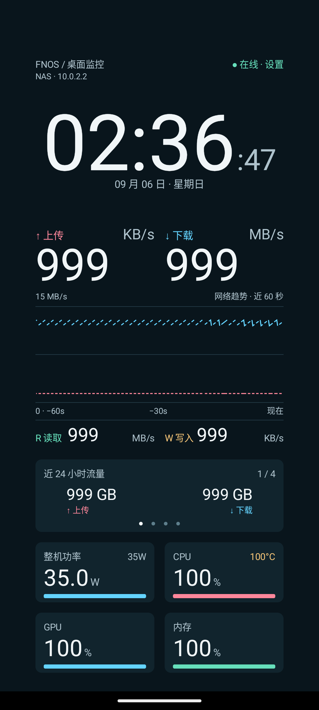
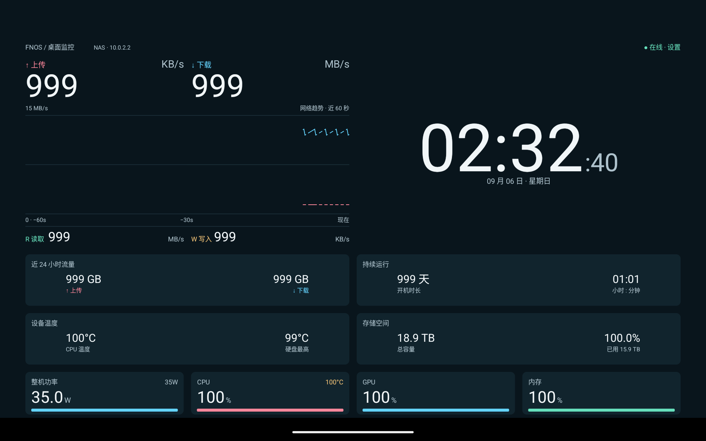

# Android NAS 显示终端

[项目首页图文教程](../README.md#android-app) · [下载最新版](https://github.com/xushuojie/routermonitor-fnos/releases/latest) · [网页连接与 Token 教程](../README.md#web-console)

原生 Java + Canvas，一个 APK 面向 Android 4.3（API 18）至 Android 17（API 37）的手机和平板。无 WebView、Google Play 服务或原生 `.so` 依赖。设置页使用 AndroidX 和 Google Material Components。最低系统版本不代表所有厂商机型均已验收；实测范围见下文。

## 下载与连接

当前下载：[1.1.5-adaptive-test APK](../downloads/routermonitor-android-1.1.5-adaptive-test.apk)。包名 `io.github.routermonitor.fnos.layouttest`，使用本地测试签名，可覆盖同签名的 1.1.1–1.1.4 测试版并保留设置；与旧正式版并存，首次安装需重新配置连接。签名密钥不随源码公开。

打开 **NAS Monitor**，填写服务根地址（例如 `http://192.168.x.x:18199`）和 NAS 网页提供的**只读 Token**。Android 与 ESP8266 共用 Docker 的 v2 接口，容量和流量统计由服务端提供。

- 点击右上角或长按画面打开设置；返回键遵循系统返回行为。
- Android 17 访问局域网需授权。拒绝后提示“需要局域网权限”，可从设置中的“局域网访问权限”进入系统设置恢复。域名可能解析到局域网，因此首次使用域名也会请求授权；公网 IPv4 地址不触发此请求。
- HTTP 明文连接显式启用，沿用现有 NAS 配置。Token 不传给重定向目标，不写日志、不打包到 APK，保存在应用私有配置中，并禁止系统备份。
- 已 root 的设备不能保证应用配置隔离；不要把 NAS 管理员密码作为 Token 填入。

## 多尺寸 UI

1.1.5 按 Android 版本明确选择设置风格，替代 1.1.4 的 DeviceDefault：

| 系统 | 设置风格 |
| --- | --- |
| Android 4.3–4.4 / API 18–20 | 系统 Holo |
| Android 5–11 / API 21–30 | 系统标准 Material |
| Android 12 及以上 / API 31+ | 随应用打包的 Google Material 3 |

输入框、滑块、选择框、复选框、按钮、对话框和时间选择器使用同一代设计。打开设置时跟随系统深浅色。Material 3 是应用组件库，不是每个 Android 大版本的系统设置副本，也不依赖厂商 DeviceDefault。
为保留 Android 4.3 安装能力固定 Material Components 1.6.1（支持 API 14 起）；仅在 API 31+ 使用 Material 3 界面。AndroidX FragmentActivity 用于现代时间选择器，网络接口、偏好键名、全屏和 OLED 逻辑保留。

按实际可用窗口、屏幕密度和系统字体比例计算布局，不按机型建立分辨率列表。采用沉浸式全屏，背景和内容允许进入摄像头挖孔区域，不为状态栏、导航栏和手势区域预留空白；从屏幕边缘滑动可临时显示系统栏。桌面窗口模式仍保留系统标题栏区域。字体放大或窗口过小时可纵向滑动查看全部模块。

顶部标题和设置入口固定在画面顶部，只有下方数据模块滚动。普通字体下，横屏可用高度比完整布局少不超过 15% 时，会轻微等比缩小以完整显示；更短的分屏或放大字体继续滚动，不强制缩小可读文字。窗口高度、宽度、密度和边距变化都会重新计算布局；Android 9/10 允许使用短边挖孔区域，Android 11 及以上允许使用所有边的挖孔区域。

- **横屏双列**：足够宽时，左侧网速→折线图→硬盘读写，右侧时间→轮播。功率、CPU、GPU、内存横排。原 960×540 手机保持这一信息关系。
- **竖屏单列**：时间→网速/曲线/硬盘→轮播→底栏。底栏通常两列，特别窄的窗口改为单列；网速和硬盘两组也会在窄窗口上下排列。
- **平板展开**：只有宽度和高度都足够时，四页辅助信息展开为两列常驻卡片。可在设置中关闭展开，恢复轮播。
- **旋转、分屏与字体调整**：重新计算位置，保留当前连接、最近 60 秒曲线及轮播页；不因尺寸变化额外请求 NAS。

字体按系统字体比例缩放；数值字号由固定的参考字符串和槽位宽度确定，不随实时数值改变。时间与网速优先突出；硬盘单位右对齐，CPU 温度固定在 CPU 卡片右上方。轮播数值和说明两端各留整张卡片宽度的 12.5%，左组左对齐、右组右对齐；极窄窗口上下排列。过长的辅助说明省略。

内部布局单位为 2/3 sp：普通字体、240dpi 的 960×540 设备中一单位对应一像素。外边距 24、模块间距 20、状态卡高 116、普通轮播高 140；这些是布局单位，不是所有设备都固定使用物理像素。四项进度条高 8，功率 0–35W，CPU/GPU/内存 0–100%。超范围保留数值、进度条封顶；无效数据显示 `—`。

支持键盘：Enter/方向键中键打开设置，右键切换轮播，上下键滚动；无障碍服务可执行打开设置和滚动操作。

Android 17 模拟器实际截图（固定示例数据，用于检查大数字和布局，并非 NAS 测量结果）：





## 夜间模式

### OLED 保护（1.1.3）

设置页新增两个默认开启的选项：OLED 保护和闲置降亮度。关闭 OLED 保护可恢复原配色和固定位置；关闭闲置降亮度可保留黑底与微移。

- 保护开启时使用纯黑背景及卡片底色，将主要白字调柔和。
- 整个画面（含标题、时间、图表及底部指标）每分钟移动一次，在水平/垂直 ±4 个物理像素内遍历 81 个位置。布局为移动预留总共 8 像素空间，防止边缘裁切；触摸坐标使用相同偏移。不会恢复摄像头避让留白。
- 无操作 5 分钟后，用 1 分钟逐步降至当前日间或夜间亮度的 60%，最低 1%。触摸、键盘操作、无障碍操作、打开设置或返回应用恢复当前时段亮度。设置对话框期间不执行闲置降亮度。
- 数据刷新不会重置闲置计时；降亮度时采样继续。复用已有每秒时钟刷新，不增加常驻动画或额外轮询。
- 这些措施仅降低 OLED 长期显示风险，不能修复或保证避免烧屏。尚未在小米实机进行长期老化测试。

设置可独立调整：

| 设置 | 默认值 | 范围或行为 |
| --- | --- | --- |
| 日间亮度 | 30% | 10–100% |
| 启用定时夜间模式 | 开启 | 可关闭 |
| 开启时间 | 23:00 | 原生 24 小时时间选择器，精确到分钟 |
| 关闭时间 | 07:00 | 支持跨午夜 |
| 夜间亮度 | 10% | 1–100%，独立于日间亮度 |

时间采用上海时区，与显示时钟一致；已联网校时后使用服务端校准的时间。开启时刻包含在夜间，关闭时刻恢复日间亮度；两个时间相同表示全天夜间模式。保存后立即生效，不需要重启。旧配置缺少新字段时自动采用以上默认值。

只调整本应用窗口亮度，不改系统全局亮度，不申请系统设置写入权限。应用在前台时保持亮屏；退到后台停止轮询并允许系统休眠。未添加后台常驻或开机自启。

## 数据与性能

- 网络默认每 500ms 拉取，可选 200ms；状态每秒一次。屏幕尺寸变大不会提高请求频率。
- `/net?v=2&since=…&epoch=…` 最多批量返回四个 200ms 采样点。历史最多 320 点，只展示最近 60 秒；重复点跳过，缺失点断线。
- 两条曲线共用从零开始的纵轴，上限取窗口峰值的 115%，向上取两位有效数字，最小 1KB/s。新峰值立即扩展，较低范围持续 2 秒后收缩。历史峰值保留到退出 60 秒窗口，避免裁切。
- 数字网速采用服务端约 1 秒平均值；`/status?display=1&v=2` 中的温度、流量、容量沿用服务端采集周期。遵守 `valid`、`null` 和数据年龄，缺失数据不会变成零。
- HTTP `Date` 校准显示时间，之后使用单调时钟推进，不修改手机系统时钟。
- 两条独立、无重叠轮询，连接/读取超时各 1.5 秒，失败按 1/2/4/8/10 秒退避，响应上限 16KB。
- 轮播每 5 秒翻页，180ms 横向切换；仅数据、时钟、滚动和短时动画触发重绘。不是持续 60fps 渲染。
- `NasMonitor` 每 30 秒记录请求计数、数据年龄、纵轴上限、峰值和最长绘制耗时，不记录连接凭据。

## 构建与验证

使用 JDK 17–21、Gradle Wrapper 8.11.1、AGP 8.9.1、Android SDK `platforms;android-36-ext19` 与 `build-tools;35.0.1`。首次构建需联网下载 Maven 依赖。compile SDK 36-ext19，target 37，min 18。

```sh
export JAVA_HOME=/path/to/jdk
export ANDROID_HOME=/path/to/android-sdk
python3 android/build.py
```

构建会运行 Robolectric 控件测试再生成 release 包。正式签名通过 `ANDROID_KEYSTORE`、`ANDROID_KEY_ALIAS`、`ANDROID_KEYSTORE_PASSWORD`、`ANDROID_KEY_PASSWORD` 指定；必须保持原发行签名才能覆盖正式版。
也可在 android/ 中运行 `./gradlew assembleDebug testDebugUnitTest`；默认 Gradle debug 签名与本次交付的本地测试签名不同，勿用它覆盖现有测试版。本次交付另行使用原测试密钥签名。

普通 Java 自检文件保留，可单独编译运行；原先不依赖 Maven 的 javac/aapt 单文件构建方式不再适用于 1.1.5。

普通 Java 自检覆盖：数值单位、纵轴、历史序号与容量、夜间跨午夜/边界/全天、多尺寸布局边界和模块不重叠。

新版模拟器可用固定示例数据复查大数字和权限流程：

```sh
python3 android/test/serve_fixture.py
```

仅监听本机 `127.0.0.1:18998`；模拟器填写 `http://10.0.2.2:18998`、Token `fixture-only`。示例包含 999 网速、100% 占用和高温值，不是 NAS 实时数据。测试结束关闭脚本。

## 实测范围

1.1.5：已有 Robolectric 控件报告显示 13 项通过，普通 Java 自检已在此前构建时运行。下列正式版设备记录主要来自 1.1.0，不能视为 1.1.5 的实机验收；本次 Windows 同步未重跑 Android 构建。


- Android 4.3 OPPO R2017：同一发布签名覆盖安装，原 NAS 地址和 Token 保留，真实数据持续更新；横屏布局、CPU 温度、单位对齐已检查。
- Android 17/API 37 ARM64 模拟器：发布 APK 正常安装；局域网权限拒绝提示和授权恢复、HTTP 示例数据连接已检查。
- API 37 模拟器检查了 1080×2400 手机、1920×1200 横屏平板、1200×1920 竖屏平板，以及 200% 字体下的重排与滚动。切换尺寸和字体后 PID 保持不变，采样继续。
- 通过设置界面将夜间时段改为 22:01–08:00、亮度改为 23%，重启后读取配置确认保存；系统窗口属性确认实际应用亮度为 0.23。跨午夜、精确起止边界、同日起止及全天模式由 Java 自检覆盖。
- 未进行所有厂商 ROM、中间各 Android 版本实机或 24 小时压力测试。
- 1.1.1 修复针对小米 15 Ultra 横屏顶部裁切反馈：补充短横屏、扣除安全边距的高密度窗口、字体放大、极短分屏及高度变化的 Java 回归用例。尚未在该机型实机复测。
- 1.1.2 根据后续反馈改为忽略挖孔边距的沉浸式全屏；已完成编译和布局自检，仍需小米 15 Ultra 实机确认。

历史版本 1.0.x 在同一旧手机中，两档各观察约 62 秒：500ms 模式 PSS 约 14–20MiB，200ms 约 24–28MiB；离开应用后 10 秒网络计数不变，断网后恢复通过。上述历史数据不是新版或其他机型的性能承诺，手机功耗也不能沿用 ESP8266 的约 0.55W 测量值。
