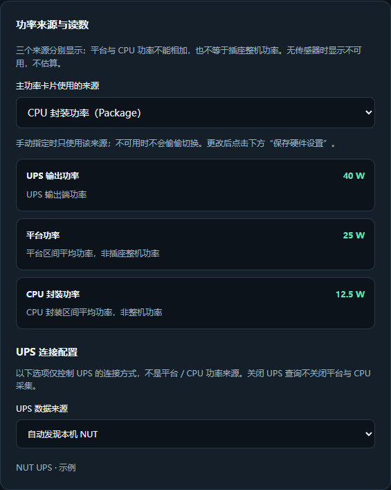
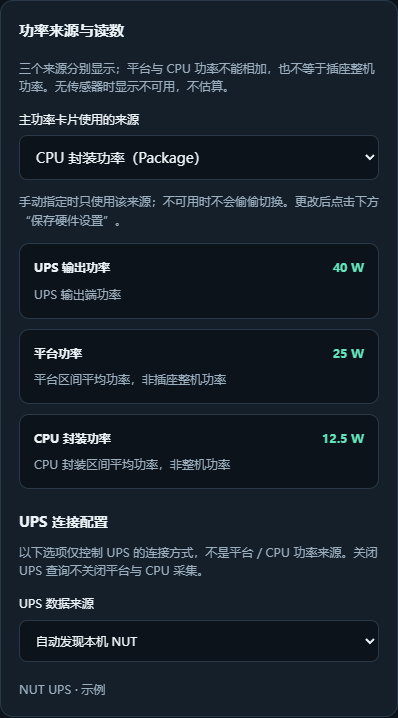

# 服务端 1.3.0-7：功率来源选择、独立读数与自动降级

需要安装本次构建的 1.3.0-7，旧 1.3.0-5 安装包不包含此功能。安装包见 [v1.3.0-7 Release](https://github.com/xushuojie/routermonitor-fnos/releases/tag/v1.3.0-7)。

## 在哪里查看和选择

1. 升级到 **1.3.0-7** 后，刷新网页，打开“设置 → 硬件与采集”。
2. 在“功率来源与读数”中，找到“主功率卡片使用的来源”。可选自动、UPS 输出、平台（PSYS）、CPU 封装（Package）。
3. 点击“保存硬件设置”，等待下一次采集刷新。自动模式按下面的顺序降级；手动模式仅显示所选来源，缺失时明确显示不可用。
4. “数据展示”的“各来源功率”以及设置中的三项读数同时显示 UPS、平台和 CPU 封装。即使有 UPS，也能查看其他可用来源。三者范围可能重叠，不能相加。






以上是 1.3.0-7 真实前端配合示例数据的截图，不代表你的设备一定具有这些传感器。

下方“UPS 连接配置”的 NUT 下拉框只控制 UPS 连接方式，与上方的功率来源选择分开。关闭 UPS 查询后，平台和 CPU 仍会采集；自动模式可使用它们，手动选 UPS 则显示不可用。

## 自动模式的来源顺序

| 优先级 | 网页标题 | 实际范围 |
| --- | --- | --- |
| 1 | UPS 输出功率 | 现有本机 / 远程 NUT；UPS 接多个设备时不等于 NAS 单机功率 |
| 2 | 平台功率 | powercap 的 `psys` 能耗域，范围由硬件定义，不等于插座功率 |
| 3 | CPU 封装功率 | `package-N` 能耗域；多个 CPU 合计，不包括磁盘、独立显卡及电源损耗 |
| 4 | 功率不可用 | 无传感器或数据不完整时显示 `—`，不估算 |


*实际网页前端、12.5W 示例数据，不是实机读数。*

网页功率卡片自动切换标题，下方说明范围，“硬件采集状态”新增功率来源诊断。不需填写额外参数。关闭 UPS 查询不会关闭平台 / CPU 功率降级。

## 采集原理

宿主机现有辅助进程只读采集 Linux powercap `energy_uj`，用两个样本的能量差除以单调时钟时间差换算瓦数。通常约 5 秒更新，首次需要两个连续样本；数值为区间平均值，不是瞬时插座测量。

RAPL 没有直接提供瞬时功率，单位和计数范围见 [Linux powercap 官方文档](https://www.kernel.org/doc/html/latest/power/powercap/powercap.html)。硬件能耗遥测可能来自硬件模型，不等于外部功率计精度。本次不会使用 TDP、CPU 占用率或固定系数自行估算整机功率。

支持内核实际暴露 `psys` / `package-N` 的平台，包括提供相应接口的 Intel / AMD 设备；并非所有 CPU、内核和飞牛设备都支持。不会安装驱动、读取 MSR 设备、修改 sysfs 权限或能耗限制，也不会把 GPU 或某一电源轨猜成整机功率。

宿主机原子写入 `docker/host-metrics/power.json`，服务通过已有只读挂载获取。网页容器没有新增提权或 Docker socket 挂载；HTTP 请求只读后台缓存。

计数器重置、异常跳变、长间隔、硬件范围变化及无法确认的回绕会触发预热或不可用。重复 MMIO / MSR 域与重叠子域不相加；已发现的多 CPU 封装中一个计数器消失时，不发布偏小的部分合计。缓存超过 15 秒失效。

## Android / ESP8266 兼容性

旧 `ups.watts` 仍只表示 UPS，绝不塞入 CPU 功率。旧 Android 1.1.5 标题固定为“整机功率”，因此没有 UPS 时仍显示不可用，不会自动显示本次降级值。旧 ESP8266 同样保持原行为；本次未重新发布 APK 或固件。

新版网页使用新增 `power` 字段。新客户端可从完整 `/status` 或 `/status?display=1&v=2` 读取，并按 `scope` 显示正确标题：

```json
{
  "ups": {"watts": null},
  "power": {
    "watts": 12.5,
    "valid": true,
    "source": "powercap",
    "scope": "cpu_package"
  }
}
```

`scope` 为 `ups_output`、`platform`、`cpu_package` 或 `unavailable`。无效时 `watts` 为 `null`。完整响应额外提供 `mode`、包含三项独立读数的 `sources`、标签、原因及可用时的数据年龄；精简显示接口保留上述四字段。

## 安装后检查

1. 升级到本次构建的 1.3.0-7，确认应用和宿主机辅助进程启动。
2. 没有 UPS 时等待约两个采样周期，检查网页功率卡片标题。
3. “CPU 封装功率”是正常降级，但不是整机功率。
4. 一直不可用时，检查功率来源诊断、宿主机 powercap 接口以及辅助进程缓存更新情况。
5. 自动模式下，UPS 恢复有效数据后自动恢复 UPS 优先。暂时超时沿用原有短时缓存，过期后降级。

本次有合成传感器、缓存、协议和浏览器回归测试，尚未在飞牛实机安装或读取 RAPL 验收。
